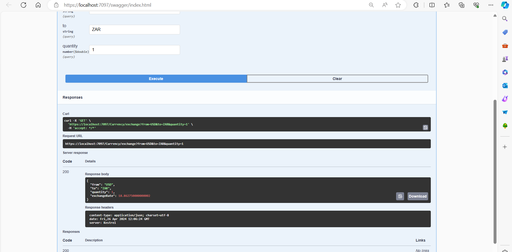

# Currency Converter API

Welcome to the Currency Converter API! This README provides essential information for using the API to convert currency values between different international currencies. The API is designed for simple, straightforward use without the need for authentication, sign-ups, or API keys.

## Overview
The Currency Converter API allows you to quickly convert monetary values from one currency to another. It does not require authentication or an account; simply use the provided endpoints to get conversion rates in real-time.

Key features:
- **Simple to Use**: No authentication or sign-up is required.
- **Real-Time Conversion**: Get the most up-to-date currency conversion rates.
- **Wide Currency Support**: Convert between a wide variety of international currencies.

## Endpoints
The Currency Converter API has two main endpoints:

- **GET /convert**
  - Converts an amount from one currency to another.
  - Query Parameters:
    - `from`: The source currency code (e.g., "USD").
    - `to`: The target currency code (e.g., "EUR").
    - `amount`: The amount to convert (e.g., 100).

- **GET /rates**
  - Retrieves the current exchange rate for a specific currency pair.
  - Query Parameters:
    - `from`: The base currency code (e.g., "USD").
    - `to`: The target currency code (e.g., "EUR").

# FINISHED IN CLASS - SPUR PRIZE PLS 😁
